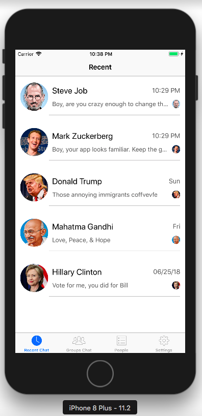
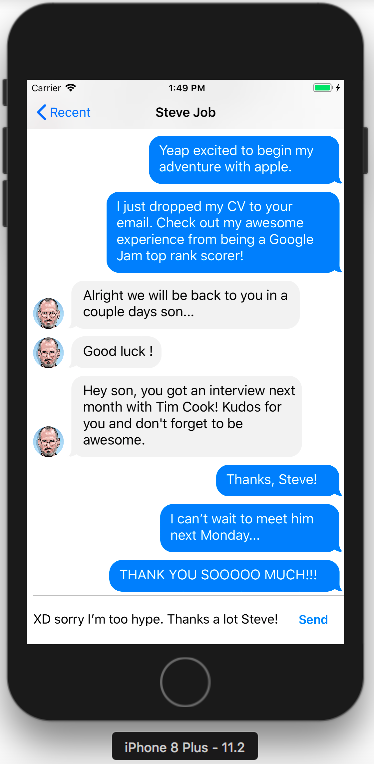

# Friendster-Messenger 
:iphone: Chat application for iOS/iPhone. I kicked off last weekend by recreating the Friendster Messenger chat application. It was supposed to be a clone of Facebook Messenger chat app but I rebranded the app name.  

## Friendster-App: What this project does :

**UX/UI programmatically** 
- In this project, I created the initial screen of friends from scratch & learn about how to align views using Autolayout in code without storyboards.
- Create those nifty little chat bubbles that you see inside of almost every chat application out there. There is a little trick that all chat messenger app does, and that is... implemented here!
- Create a custom UITabBarController and set it as our main root view controller on AppDelegate. I went through how to create a highlight when selected a cell and finally take a look a some additional date formats for NSDate.

**CoreData** 
- In this project, I learned how to fetch the most recent message for our friends using the power of Core Data.  First we sort our messages in descending order on our date property. Next we create a predicate that filters based on a singular friend.  Finally we execute the above algorithm for each friend in our database.
- Implement how to send an outgoing message in our Facebook Messenger application.  In addition, I properly inserted rows into a collection view based on the date of the message.
- Implementation of another NSFetchedResultsController by updating our main FriendsController code. Seeing the true power behind the fetched results by eliminating all the manual sorting we performed in the beginning (XD, CoreData is not that bad...

